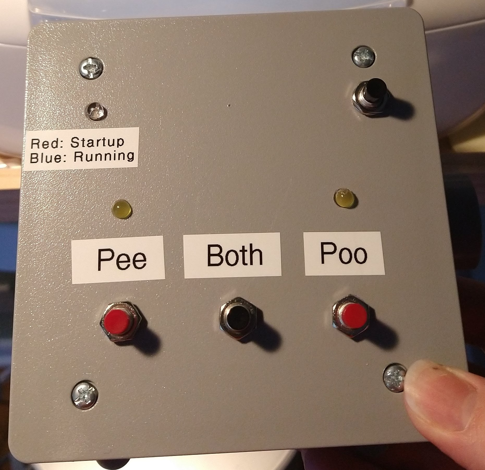
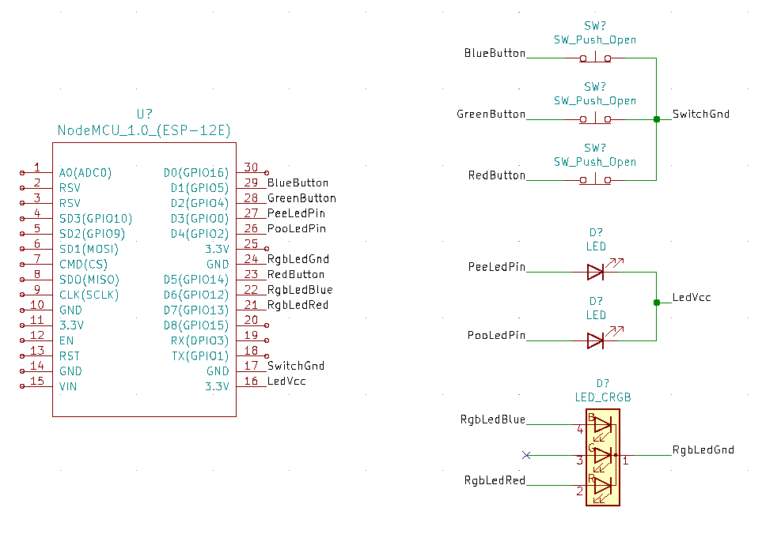
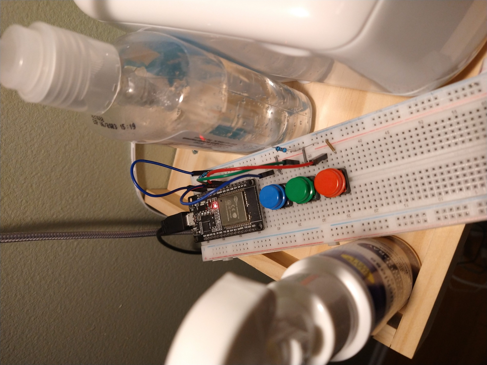
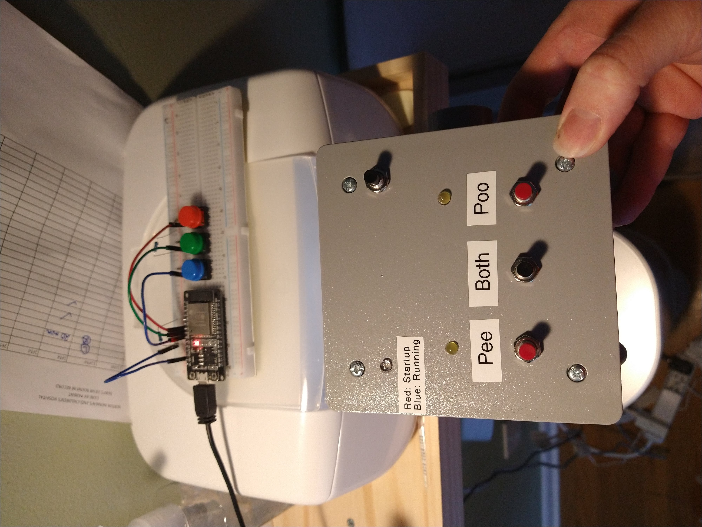

# Diaper Log

This handy gadget helps us keep a log of all dirty diapers. This data is an important metric in tracking the health of a baby. Every time we change a diaper, we just push the appropriate button and the data is logged to a Google Sheets spreadsheet.

## Acknowledgements
These links were useful in learning that I could/how to log to Google sheets from an Arduino:
https://create.arduino.cc/projecthub/24Ishan/log-temperature-data-to-google-sheets-0b189b
https://create.arduino.cc/projecthub/gusgonnet/pushing-data-to-google-docs-02f9c4

My Google Scripts code is heavily based on this Particle app note, but the embedded code wasn't terribly useful for non-particle boards:
https://docs.particle.io/datasheets/app-notes/an011-publish-to-google-sheets/

Figuring out how to do SSL on the ESP32 and ESP8266 was the result of a ton of googling and looking at different example projects. The solution I settled on relies on copying the root CA certificate for the google scripts web app and storing it in PROGMEM. As far as I can tell this is the best and longest-lasting solution. However, the certificate will eventually need to be updated. The process is listed below.

Useful article about ESP8266 GPIO weirdness. This helped me figure out why my sketches wouldn't load:
https://www.electronicwings.com/nodemcu/nodemcu-gpio-with-arduino-ide

## Build Info
### BOM
* NodeMCU 1.0 dev kit (ESP866)
* 3 normally-closed push buttons
* 2 LEDs with current limiting resistors
* 1 RGB LED with current limiting resistor
* Lots of jumper wires, solder, and heat shrink tubing
* Project box or other enclosure
* Misc hardware/hot glue

### Schematic

### Setting Up Google App Script
* Go to [sheets.google.com](sheets.google.com)
* Start a new `Blank` spreadsheet
* Under `Tools` select `Script Editor`
* Paste the code in `Code.gs` in this repo into the `Code.gs` editor that appears
* In the top right, select `Deploy` then `New deployment`
* In the pop-up that appears, select the gear icon and choose `Web app`
* Change `Who has access` to `Anyone` and press `Deploy`
* On the screen that appears, select `Authorize access`
* Select your Google account
* On the bottom left, select `Advanced` then at the bottom `Go to Untitled project (unsafe)`
* Click `Allow`
* Copy the `Web app` `URL` and paste it into the arduino sketch

Optionally you can follow this process a second time so that you have two sheets, one for actual use and one for testing.

Don't forget to also set your WiFi SSID and password in `Secrets.h`

## My Process
My initial prototype used an ESP32 because that was the first thing I laid hands on. It worked well and was in use for several days with no issues. However, it lacked any LEDs or feedback of any kind. It was also built on a breadboard, making it too delicate for long term use.

For the first full version I used a electrical enclosure I got from a hardware store. I used a ruler and dry erase marker to mark holes on the front panel for LEDs and push buttons, then drilled the holes with a cordless drill. The surface is textured, so I used isopropyl alcohol to clean up the pattern. Buttons were mounted using their included panel nuts. LEDs were set in place with hot glue after soldering current-limiting resistors and leads to them.

Note that in my circuit the two single LEDs are wired with a common positive and must be pulled low to turn on. I had originally planned for these to be common negative, but I soldered them up the wrong way around and just went with it.

I cut up pre-made jumper wires and soldered them to all leads to connect them to the ESP8266. The connections to the ESP8266 itself were a bit loose, so they're held in place with hot glue. Soldering directly to the NodeMCU would be more reliable, but I wanted to leave open the possibility of reusing it in a different project.

Note that the GPIO connections aren't in the most  intuitive order. As it turns out, the ESP8266 may fail to boot if the initial GPIO states aren't what it expects. Because the push buttons pull their GPIO to ground any time they're not pressed, they have to be placed on "safe" GPIO pins. Other GPIO configurations may prevent the program from running, may result in a short circuit, or may prevent code upload. There's a link in the Acknowledgements section for more info.

One final note: When mounting the ESP8266 ensure that it's position will allow the populated front panel to close _and_ that the USB port can be accessed. After a failed first attempt, I placed the NodeMCU where the USB port can be accessed through the port on the bottom of the box. This makes it very easy to plug and un-plug. I used nylon stand-offs and hot glue to mount my MCU, making it relatively easy to move if needed.

## Gallery
This image shows my initial prototype using an ESP32 on a breadboard.

This image shows the finished version 1 enclosure next to the prototype.

## How I got the Google root CA certificate
I don't know if this is a good way of doing it, but I just pasted the web app link from the deploy screen into my web browser. Then I clicked on the lock icon in the address bar, clicked on "Connection secure" then "More Information". Under security I selected "View Certificate", switched to "GTS CA 1C3", and under Miscellaneous selected "PEM (cert)". I opened that up in VS Code and used column editing to format it to insert into the code.
